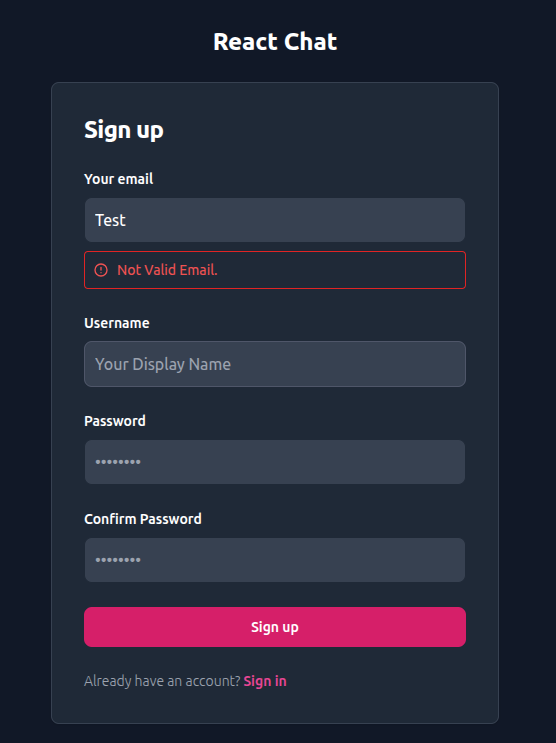

# 💬 Chat-React: Real-Time Chat Application with React & Appwrite

A chat app with real-time capabilities that utilizes Appwrite on the backend.

## 🌟 Project Overview

Chat-React is a straightforward **Real-Time Chat Application** built to demonstrate the integration of a modern **React** frontend with a powerful **Backend-as-a-Service (BaaS)** platform like **Appwrite**.

This project features a secure authentication flow and sets the foundation for real-time communication within public or private chat rooms (pending future expansion).

---

## 📸 Screenshots

Here are some visual examples of the application interface:

Login/Sign Up Page
Chat Room Interface





---

## ✨ Key Features

- **User Authentication:** Secure sign-up, login, and logout functionalities.
- **Advanced Form Validation:** Utilizes `react-hook-form` for robust frontend validation of email and password complexity.
- **Session Management:** Global state management using **React Context** to handle user status and session information across the application.
- **Responsive Design:** A clean, responsive user interface styled efficiently with **Tailwind CSS**.
- **Loading & Error Handling:** Clear loading indicators and error toasts (`react-hot-toast`) enhance the user experience.

---

## 🛠️ Tech Stack

The project is built on a modern and efficient technology stack:

- **Frontend:**
  - **React:** JavaScript library for building user interfaces.
  - **Tailwind CSS:** Utility-first CSS framework for rapid styling.
  - **React Router DOM:** For declarative navigation and routing.
  - **React Hook Form:** For high-performance form management and validation.
  - **React Hot Toast:** For simple, attractive success/error notifications.
- **Backend (BaaS):**
  - **Appwrite:** An open-source backend platform used for:
    - User Authentication (Accounts).
    - Database (Databases).
    - Real-Time capabilities.

---

## 🚀 Setup and Run Locally

Follow these steps to get a copy of the project up and running on your local machine.

### Prerequisites

Ensure you have the following installed:

- Node.js (v16 or higher).
- Docker (required to run Appwrite locally).

### Step 1: Clone and Install Dependencies

Clone the repository:

```bash
git clone [https://github.com/Abdulrahman-Ka/chat-react.git](https://github.com/Abdulrahman-Ka/chat-react.git)
cd chat-react
Install React dependencies
npm install
```

### step 2: Appwrite Configuration

1. **Start Appwrite:** Run your Appwrite instance locally using Docker.

2. **Create Project:** Create a new project in the Appwrite Console 3. and retrieve your Project ID.

3. **Set Environment Variables:**

- Create a file named .env.local in the root directory of your project.

```js
//appwrite.Config.js
...
export const API_ENDPOINT = import.meta.env.VITE_API_ENDPOINT;
export const PROJECT_ID = import.meta.env.VITE_PROJECT_ID;
export const DATABASE_ID = import.meta.env.VITE_DATABASE_ID;
export const COLLECTION_ID_MESSAGES = import.meta.env
  .VITE_COLLECTION_ID_MESSAGES;

const client = new Client().setEndpoint(API_ENDPOINT).setProject(PROJECT_ID);

...

```

- Add your environment variables (replace the placeholders with your actual values):

```
# These names must match what your React app expects in appwriteConfig
VITE_APPWRITE_PROJECT_ID="YOUR_APPWRITE_PROJECT_ID"
VITE_APPWRITE_ENDPOINT="http://localhost/v1"
```

4.  **Configure CORS**: Add http://localhost:5173 (or your specific port) as a trusted Web Platform in your Appwrite Console settings to prevent CORS errors during local development.

### step 3: Run the Application

Start the development server:

```bash
npm run dev
```

The application will run in development mode, typically accessible at http://localhost:5173 in your browser.

## 🤝 Contribution

Contributions are always welcome! If you have any suggestions, feature requests, or bug fixes, please:

Create a new branch (git checkout -b feature/AmazingFeature).

Commit your changes.

Create a Pull Request.
